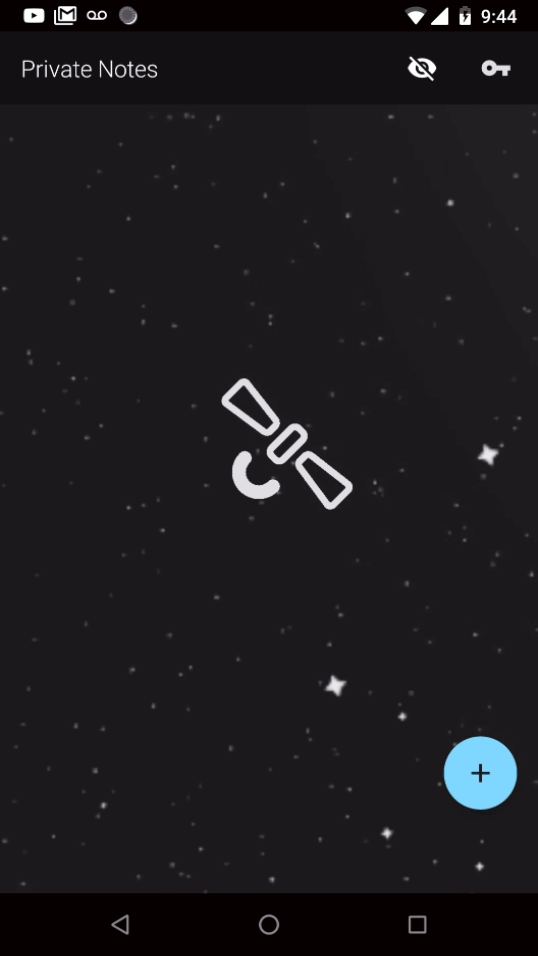
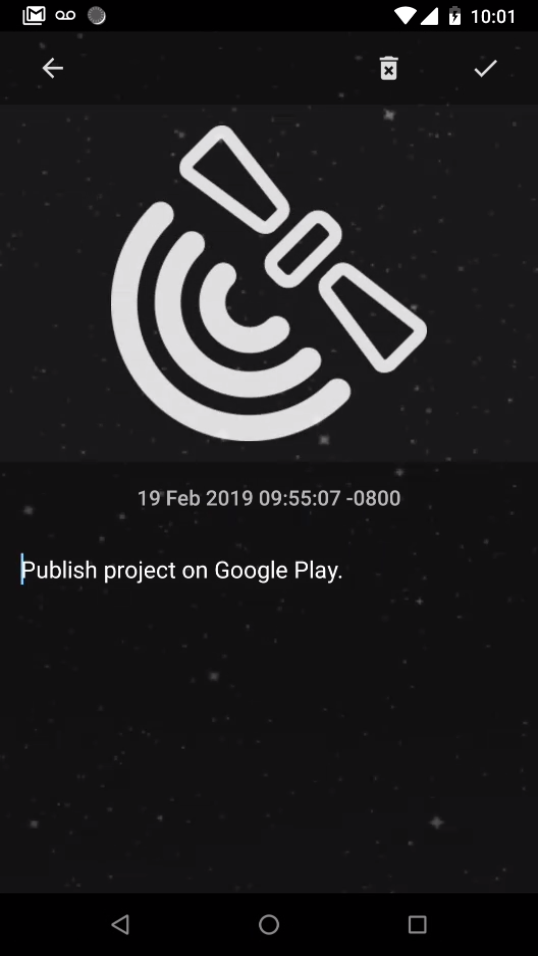
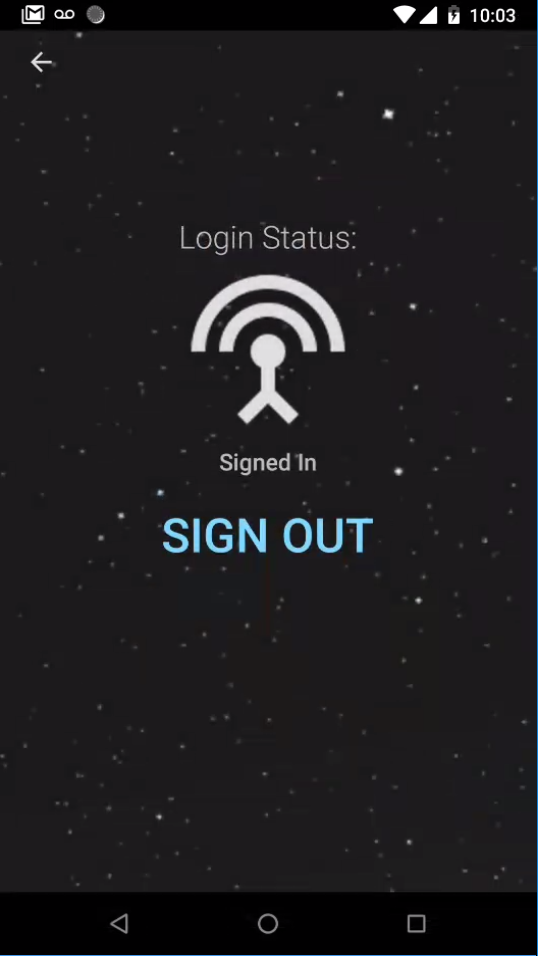

### Please Note:
- Since I see people are still looking at this repo, I want to be clear that I no longer recommend multi-module (i.e. multiple gradle subprojects) architecture unless you actually have a good reason for it. In this case, it really just adds extra complexity for no real benefit. However, multi-platform projects would be a great example of a situation where you'd want to use multi-module.

# SpaceNotes

New to Kotlin? Whether you are a seasoned Java veteran, or you're just starting
out with Kotlin for Android, consider checking out [Application Programming
Fundamentals w/ Kotlin](https://www.udemy.com/application-programming-fundamentals-with-kotlin/learn/v4/overview). If you like my videos and repositories, I think
you'll really enjoy a more polished course experience from wiseAss!

## What is SpaceNotes?

SpaceNotes is a Kotlin based Android Application, which was built with
best practices an innovation in mind. The app uses Coroutines for
concurrency and cross-module/boundary communication, a Clean Domain
Layer to allow the application to work properly across multiple platforms,
and a few of my favourite APIs from Android Architecture Component
and Firebase.

## Software Architecture

### Feature Specific (Front End Android):

#### NoteList Feature

This feature displays whatever Notes are currently available based on the user's status, such as: Anonymous, Registered Private, Registered Public

* INoteListContract specifies the different interactions between classes and the events which may occur in this particular feature
* NoteListActivity is a feature level “container”, within which these different things are deployed in to (it is also the entry point of the feature)
* NoteListLogic is the “decision maker” of the feature, which handles the events and interactions specified in the contract (this kind of class is the most important to test)
* NoteListView contains logic and bindings to the user interface
* NoteListAdapter contains a decoupled RecyclerView.ListAdapter w/ DiffUtil
* NoteListViewModel contains the most recent data which has been returned from the “backend” of the application (or data which is passed into the feature via navigation), and persists this data so that the logic class or view does not need to (if they did, it would break the separation of concerns)
* NoteListInjector: Build logic (Dpependency Injection Implementation) for this feature.

#### NoteDetail Feature

This feature allows the User to view, update, create, and delete a Note. Data is stored in various local/remote datasources based on whether the user is or isn't logged in, and if they are in public or private mode.

* INoteDetailContract specifies the different interactions between classes and the events which may occur in this particular feature
* NoteDetailActivity is a feature level “container”, within which these different things are deployed in to (it is also the entry point of the feature)
* NoteDetailLogic is the “decision maker” of the feature, which handles the events and interactions specified in the contract (this kind of class is the most important to test)
* NoteDetailView contains logic and bindings to the user interface
* NoteDetailViewModel contains the most recent data which has been returned from the “backend” of the application (or data which is passed into the feature via navigation), and persists this data so that the logic class or view does not need to (if they did, it would break the separation of concerns)
* NoteDetailInjector: Build logic (Dpependency Injection Implementation) for this feature.

#### Login Feature

This feature allows the User to authenticate with GoogleSignIn; which
is currently the only supported sign in function. No passwords or in-app
Sign up is required.

**Note:** I normally advocate against using Activities as Views, but I
ran in to a tight-coupling problem with GoogleSignIn API (which requires you
to override Activity.onActivityResult(...). Given this tight coupling,
and the simplicity of this feature (it only has two buttons including the toolbar), I decided to just use the Activity as a pragmatic decision.

* ILoginContract specifies the different interactions between classes and the events which may occur in this particular feature
* LoginActivity acts as the View and Container in this feature (for reasons mentioned above)
* LoginLogic is the “decision maker” of the feature, which handles the events and interactions specified in the contract (this kind of class is the most important to test)
* LoginResult Wrapper for when GoogleSignInProviders does it's thing (logging a User In)
* LoginInjector: Build logic (Dpependency Injection Implementation) for this feature.

#### Common:
* Navigation.kt: Contains Top-level functions for starting each feature with the appropriate arguments.
* Constants.kt: Contains messages and keys for front end Android
* BaseLogic.kt: Abstract class for Logic classes. Could be optimized, currently just contains a DispatcherProvider (for Coroutines) as a property, and a Job object for keeping track and disposing in-flight coroutines.
* AndroidExt.kt: Some handy Extensions functions for front end Android

### Domain:
The Domain Layer of this application has three primary purposes:
* Abstraction of the Data Layer of the application
* Providing a common, 3rd party library free set of Models (such as Note.kt) for different platforms of the App
* Providing a High-Level description of the applications primary functions based on problem domain analysis (such as User Stories)

#### Packages:
* domainmodel: POKOs (Plain Old Kotlin Objects) to be shared as a common model between different modules
* error: Sealed Class which contains application specific errors
* interactor: Interactors exist to coordinate the back end data sources. This is generally only necessary when there is more than one back data source, otherwise it ends up being
another unnecessary layer of abstraction over the repository.
* repository: Repository Interfaces which dictate the contractual obligations of each part of the back end. This allows the domain layer to coordinate the different back end components without needing to know their real implementations/libraries/dependencies.
* servicelocator: Service Locator promotes Functional Purity of the Interactor's functions, and acts as a method of Dependency Injection (by providing the dependencies as arguments to functions)
* DispatcherProvider: Used for Coroutines Implementation

### Data (Android Back End):
The Data Layer of this application contains implementations of the data sources which are described in the repository package of the domain layer.

#### Auth:

Currently implemented with FirebaseAuth; manages user authentication.

#### Data Models:

API specific data models, which are mapped from/to domain models. Each data model is created for a particular API, such as Firestore and Room.

#### Note:

Implementations for the anonymous, registered private, and registered public data sources which persist Note objects.

#### Transaction:

Transaction is only used for registered private users. It's purpose is to store offline transactions that the user makes to their registered repository, and attempts to push those transactions when the user reconnects to the remote firestore database.

#### DataExt.kt:

Contains all of the obnoxious but necessary Data Model Mapping functions, and some Coroutine wrappers over Firebase/GMS Tasks API

## Can I use code from this Repo?
Absolutely, pursuant to the project's [LICENSE](LICENSE.md). That being said, the logo and name are my intellectual creations, so don't use them unless you are linking/reffering to this Repo.

Follow the rules in the license, and you're good.

## Architecture Style:
This project uses Model-View-Whatever. It is the software architecture that has no particular style, yet accommodates all situations. In a less Zen way of speaking, I don't follow MVP, MVC, or MVVM strictly. I use parts of all styles of architectures based on whatever feature I'm creating, and that is what dictates the ultimate architecture of a given feature.

If you want me to explain in slightly more familiar terms, I basically apply MVP + VM as a front-end session datastore (such as arguments passed in from Activity Intents, current user states, current note to be displayed). I don't use ViewModels as Decision Maker Classes, hence the Logic class.

## Contact/Support me:

Follow the wiseAss Community:
https://www.instagram.com/wiseassbrand/
https://www.facebook.com/wiseassblog/
https://twitter.com/wiseass301
http://wiseassblog.com/
https://www.linkedin.com/in/ryan-kay-808388114

Support wiseAss here:
https://www.paypal.me/ryanmkay

## License
 * Copyright 2016, The Android Open Source Project
 *
 * Licensed under the Apache License, Version 2.0 (the "License");
 * you may not use this file except in compliance with the License.
 * You may obtain a copy of the License at
 *
 *      http://www.apache.org/licenses/LICENSE-2.0
 *
 * Unless required by applicable law or agreed to in writing, software
 * distributed under the License is distributed on an "AS IS" BASIS,
 * WITHOUT WARRANTIES OR CONDITIONS OF ANY KIND, either express or implied.
 * See the License for the specific language governing permissions and
 * limitations under the License.
 *
